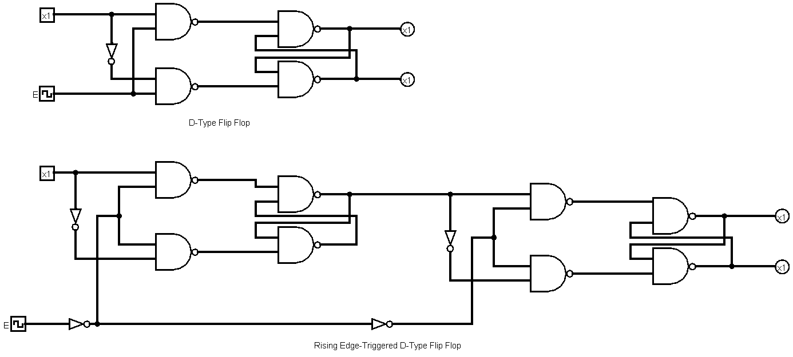

# 8bit RAM Module

RAM is built from individual data cells. For instance:

- **2 GB RAM** = 2,000,000,000 bytes  
- **2,000,000,000 bytes** = 16,000,000,000 bits  

Thus, a 2 GB RAM would have **16,000,000,000 data cells**.

For this weekend project, I will design a basic 2-word, 8-bit RAM module, demonstrating the essential building blocks of RAM.

---

## Designing Data Cells

Each data cell is implemented using a **D-Type Flip-Flop** circuit, which is the fundamental memory element that can store a single bit.

### D-Type Flip-Flop Diagram

  
*Figure 1: Schematic diagram of a D-Type Flip-Flop and Master-Slave Flip-Flop with a rising edge trigger*

### How the D-Type Flip-Flop Works

In this design, the flip-flop uses a Clock signal (CLK) to control data capture:
- **CLK high (Enable active):** The circuit is transparent, so the output (Q) follows the input (D).
- **CLK low (Enable inactive):** The flip-flop holds the previously captured value, regardless of changes in D.

This behavior ensures that data is reliably stored on the clock’s rising edge.

---

## Master-Slave Flip-Flop

A Master-Slave configuration improves reliability by using two flip-flops in sequence.

### Master-Slave Flip-Flop with Rising Edge Trigger

- The **master** flip-flop captures the input on the rising edge of the clock.
- The **slave** flip-flop updates its output on the falling edge.

This two-stage process prevents glitches due to propagation delays, ensuring the stored data remains stable until the next update.

---

## Video Demonstration of Data Cells

Watch this video to see the data cell (flip-flop) operation in action:  
[Data Cells Video](https://github.com/user-attachments/assets/422db3e2-5637-44bd-833b-c0d6cd82c5c4)

---

## Combining Data Cells to Form an 8-bit Register

Multiple flip-flops are grouped together to form a register that stores an 8-bit word.

### 8-bit Register Diagram

  
*Figure 2: Schematic diagram of an 8-bit register created by combining 8 D flip-flops*

### Video Demonstration of the 8-bit Register

View the demonstration:  
[8-bit Register Video](https://github.com/user-attachments/assets/da56aa87-3fd6-410b-afdf-152ff97ced3d)

---

## Write Mechanism

To write data to our RAM module, we need a way to select which register (word) to update.

### 1 to 2 Decoder

A 1-to-2 decoder uses one address bit to generate two outputs, each enabling one register.  

### Data Bus for Registers

A common 8-bit data bus feeds the same data to both registers. With the decoder controlling the write-enable, only the selected register will store the data during a clock pulse.  

---

## Read Mechanism

To retrieve stored data, we use a multiplexer to select the output from the correct register.

### 2 to 1 Multiplexer

A 2-to-1 multiplexer, built from basic logic components, selects one of two 8-bit outputs (one from each register) based on a single select signal.  

---

## Complete Module

The complete RAM module integrates the data cells (registers), decoder for writing, and multiplexer for reading into a cohesive 2-word, 8-bit RAM system.  

---

This design demonstrates the core principles of memory:
- **Storage:** Using D-type flip-flops to store individual bits.
- **Organization:** Combining flip-flops into registers to form words.
- **Addressing:** Using a decoder to control write operations.
- **Retrieval:** Using a multiplexer to read out the correct word based on the address.

Feel free to expand or modify the design for additional memory words or bit widths.
